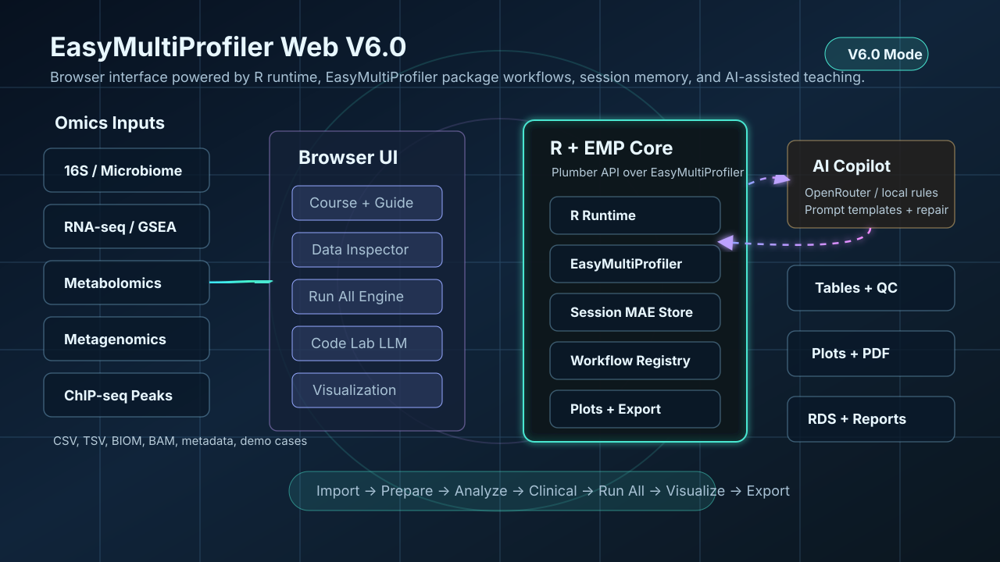

# EasyMultiProfiler Web v7.0

**多组学下游分析与可视化 — 浏览器版（R 后端 + EasyMultiProfiler 分析核心 + 静态前端）**


> **V7 重大升级**：从 GitHub `clone` → 启动网页**只需 1 行命令**。脚本会
> ① 自动识别你的 OS / 架构；
> ② 缺什么装什么（**git / python3 / R** 自动按系统装）；
> ③ 顺带装好 **CRAN + Bioconductor + EasyMultiProfiler** 依赖；
> ④ 启动后端 + 网页并打开浏览器。
>
> **不再需要用户预先安装 R / RStudio / EMP 包**。



---

## 一行命令启动（推荐）— 自动识别 OS

脚本会**自动检测**你的操作系统并选择对应的安装路径（macOS / Linux 走 `.sh`，Windows 走 PowerShell `.ps1`）。你只需要挑与你当前 shell 匹配的那一行：

| 当前 Shell | 命令 |
|------|------|
| **macOS / Linux 终端（bash / zsh）** | `bash -c "$(curl -fsSL https://raw.githubusercontent.com/xielab2017/EasyMultiProfiler-Web/v7.0.0/webapp/scripts/install_from_github.sh)"` |
| **Windows PowerShell** | `irm https://raw.githubusercontent.com/xielab2017/EasyMultiProfiler-Web/v7.0.0/webapp/scripts/install_from_github.ps1 \| iex` |
| **Windows CMD / 双击 `.cmd`** | 下载 `install.cmd`，**双击运行**或在 CMD 中输入 `install.cmd` |

> 复制错行也没关系——`.sh` / `.ps1` 入口都内置了 OS 自检，会自动转发到正确分支。
> 例如在 macOS 的 PowerShell 7 (`pwsh`) 里跑 `.ps1`，会自动调 `.sh`。

### 已经被 `git clone` 下来的用户

```bash
bash install.sh                                  # macOS / Linux（仓库自带）
powershell -File webapp\sscripts\bootstrap_and_start.ps1   # Windows PowerShell
install.cmd                                       # Windows CMD / 双击
```

---

## 后续日常启动

- **macOS** ：双击 `Run-EMP-Web-Mac.command`
- **Windows** ：双击 `Start-EMP-Web.bat`

需要重装 R 包 / EMP 时：

- macOS ：`bash webapp/scripts/launch_emp_web.sh --repair`
- Windows ：双击 `Repair-and-Start-EMP-Web.bat`

---

## 详细文档

- [docs/INSTALL_MAC.md](docs/INSTALL_MAC.md) — macOS / Linux 安装细节 + 镜像 / 环境变量
- [docs/INSTALL_WINDOWS.md](docs/INSTALL_WINDOWS.md) — Windows 安装细节 + 故障排查
- [CHANGELOG_V7.md](CHANGELOG_V7.md) — V7 与 V6 的差异
- 打开网页后，左侧 **Guide** 页有内置交互式手册

---

## V7 亮点

- **零依赖 1 行安装**：自动识别 OS / 架构，缺 R / git / python3 自动按系统装；首次启动一次性把 EMP 装好。
- **Windows / macOS / Linux 全平台**：CRAN 官方 `.pkg` / `.exe` 与 Linux 仓库源自动选择；Apple Silicon / arm64 Windows 原生支持。
- **幂等**：日常启动只装缺失项；`--repair` 强制重装。
- **完全可降级**：`EMP_AUTO_INSTALL=0` 让脚本只诊断不安装（CI / 受限环境）。
- **完整保留 V6 全部能力**：ChIP-seq / RNA-seq GSEA / AI 解读 / Code Lab LLM / 多组学导入 等不缩水。

## 成功标志

- 网页：**http://127.0.0.1:8080**（默认 **Import** 页）  
- API：**http://127.0.0.1:8000/api/health** → `"status":"ok"`

---

## V6 亮点（V7 全部继承）

- **ChIP-seq**：BAM → MACS2/3 peaks → ChIPseeker 注释 → 与 RNA-seq / 蛋白组交叉分析  
- **RNA-seq GSEA + GO 细分**：GO BP/CC/MF、KEGG、Reactome rank-based GSEA  
- **AI 结果解读 v2.1**：CNS 级证据锚定写作模板与 LLM prompt  
- **Code Lab LLM**：多模型自动回退 + 本地规则优化兜底  
- **可视化增强**：热图尺寸可调、PCA/PCoA 防出框 publication 主题  
- **分平台安装 + Guide 页 + i18n + Run All + Course 教学**（继承 v5.0.0 全部能力）  

完整用户指南：[docs/USER_GUIDE_V5.md](docs/USER_GUIDE_V5.md)

---

## R 包 only（已有 R 4.3.3+ 的研究者）

```r
# 安装依赖（CRAN + Bioc + EMP 一键）
install.packages("remotes")
remotes::install_github("xielab2017/EasyMultiProfiler-Web", upgrade = "never",
                        dependencies = TRUE,
                        build_vignettes = FALSE)
```

启动浏览器版：

```r
EasyMultiProfiler::run_web()
```

或仍用我们维护的 Bioconductor 包：

```r
if (!requireNamespace("BiocManager", quietly = TRUE))
  install.packages("BiocManager")
BiocManager::install("EasyMultiProfiler")
```

---

## 仓库结构

```
EasyMultiProfiler-Web/
├── DESCRIPTION                # R 包元数据（v7.0.0）
├── R/                          # EMP R 包源码
├── webapp/
│   ├── backend/                # Plumber API + R helpers
│   ├── frontend/               # 静态网页
│   └── scripts/
│       ├── install/            # V7 自动安装：_platform.sh, install_r.{sh,ps1}, install_system_deps.{sh,ps1}
│       ├── bootstrap_and_start.{sh,ps1}
│       ├── install_from_github.{sh,ps1}
│       ├── launch_emp_web.{sh,ps1}
│       ├── start_local.sh
│       └── windows_r_utils.ps1
├── docs/                       # 用户/安装/技术文档
└── tests/                      # 16S / RNA-seq / Clinical 示例数据
```

---

## License

Artistic-2.0（与 Bioconductor 一致）。

## Citation

引用前请参考：https://github.com/xielab2017/EasyMultiProfiler-Web#citation