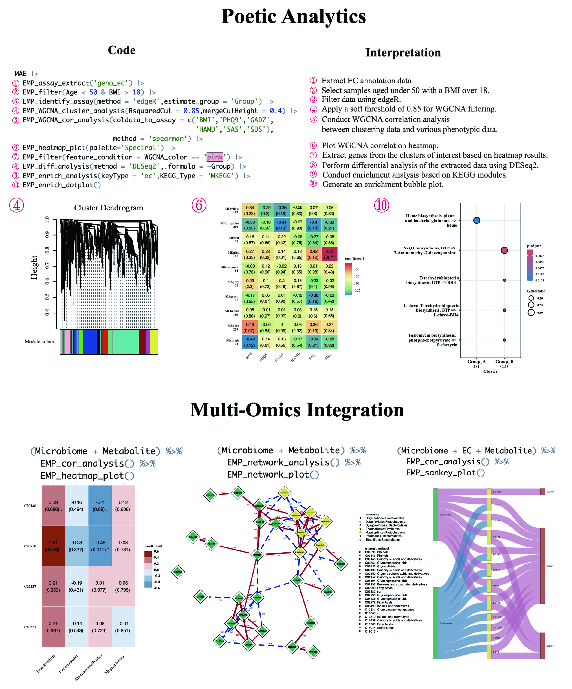

## EasyMultiProfiler: An Efficient and Convenient R package in Multi-omics Downstream Analysis and Visualization
<a href="man/figures/logo.png"></a>


The EasyMultiProfiler package aims to offer a user-friendly and efficient multi-omics data analysis tool on the R platform. It facilitates various essential tasks related to microbiome, genome, and metabolite downstream analysis, providing a seamless workflow from start to finish.

### What Can EasyMultiProfiler Offer?

- **Quick Screening**: Simplify sample selection across multiple omics for efficient research.
- **Dynamic Processing**: Effortlessly switch between standardization, differential analysis, correlation, enrichment analysis, etc.
- **One-Step Analysis**: Effortlessly execute complex methods like WGCNA and GSEA in a single step.
- **Streamlined Workflow**: Experience a clear, organized data analysis process that enhances productivity and clarity.
- **Caching Technology**: Leverage built-in caching to save time and computational resources during data exploration.

**Let EMP enhance your research and transform your data analysis experience!**

**Example below**



### Install

For Web users, use the one-line installer in `GitHub download + one-click start` below.

If you only need the R package in RStudio:

```R
if (!requireNamespace("pak", quietly=TRUE)) install.packages("pak")
pak::pak("liubingdong/EasyMultiProfiler")
library(EasyMultiProfiler)
```

### Usage and tutorial
For more details, please refer to the tutorial:

Website:  [**Source 1**](http://easymultiprofiler.xielab.net)  [**Source 2**](https://liubingdong.github.io/EasyMultiProfiler_tutorial/)  [**Source 3**](https://main--gorgeous-smakager-db1548.netlify.app/) 

### Web deployment (without Shiny UI)

This repository includes a web architecture that does **not** require Shiny as the UI layer:

- Backend API: `webapp/backend` (R + plumber)
- Frontend UI: `webapp/frontend` (HTML/CSS/JavaScript)
- Migration checklist: `webapp/WEB_MIGRATION.md`

Quick start:

```bash
# One-step install + start (recommended)
bash webapp/scripts/bootstrap_and_start.sh
```

Open:

- `http://localhost:8080` (Web UI)
- `http://localhost:8000/api/health` (API health check)

### GitHub download + one-click start (recommended for end users)

Use this single command:

```bash
bash -c "$(curl -fsSL https://raw.githubusercontent.com/xielab2017/EasyMultiProfiler-Web/master/webapp/scripts/install_from_github.sh)"
```

This command will automatically:

1. Clone `https://github.com/xielab2017/EasyMultiProfiler-Web.git`
2. Install all required dependencies
3. Start backend/frontend and open browser

Then open:

- `http://127.0.0.1:8080` (frontend)
- `http://127.0.0.1:8000/api/health` (backend health)

No separate manual package installation steps are required.

#### Maintainer release packaging

```bash
bash webapp/scripts/package_release.sh
```

The zip package is generated under `webapp/dist/` and can be uploaded to a GitHub Release for users to download directly.

### Acknowledge
This package integrates multiple widely used tools, and we sincerely acknowledge their authors for their valuable contributions. Special thanks to [**Prof. Guangchuang Yu**](https://github.com/YuLab-SMU)  (Southern Medical University, China) for his guidance. If EMP contributes to your research, please consider citing the following papers. Your recognition is invaluable to our continued work.

- EasyMultiProfiler: An Efficient Multi-Omics Data Integration and Analysis Workflow for Microbiome Research doi: https://doi.org/10.1007/s11427-025-3035-0

- EasyMicroPlot : An Efficient and Convenient R Package in Microbiome Downstream Analysis and Visualization for Clinical Study. Frontiers in Genetics. doi:  https://doi.org/10.3389/fgene.2021.803627

### More Awesome Tools
- aplot: Simplifying the creation of complex graphs to visualize associations across diverse data types. doi: https://doi.org/10.1016/j.xinn.2025.100958
- Using clusterProfiler to characterize multiomics data. Nature protocols doi: https://doi.org/10.1038/s41596-024-01020-z

### Contributing
We welcome any contribution, including but not limited to code, ideas, and tutorials. Please report errors and questions on GitHub [**Issues**](https://github.com/liubingdong/EasyMultiProfiler/issues). 

