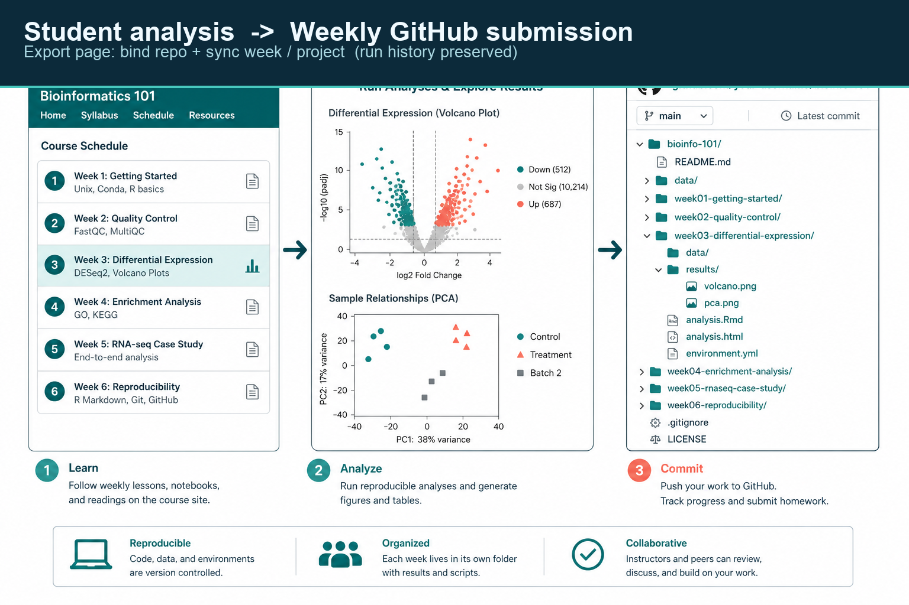
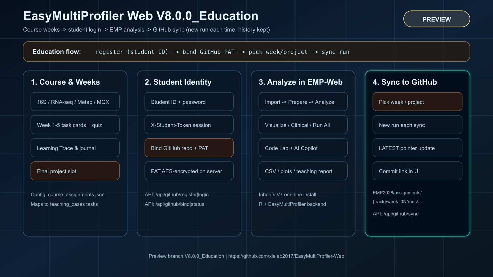

# EasyMultiProfiler Web · V8.0.0_Education

**教育预览版（Preview）** — 在 V7 一键安装与多组学分析能力之上，新增 **课程按周作业 + 学号登录 + GitHub 仓库同步**。


> **分支**：[`V8.0.0_Education`](https://github.com/xielab2017/EasyMultiProfiler-Web/tree/V8.0.0_Education)  
> **定位**：课堂试用 / 课程作业提交预览，**非**替代正式 `main` / `v7.0.0` 生产分支。


---

## 这是什么

EasyMultiProfiler Web 是浏览器版多组学下游分析平台（Plumber R API + 静态前端 + EasyMultiProfiler 核心）。

**V8.0.0_Education** 面向教学场景，让学生可以：

1. 在 **Course** 里按 case / 周次完成微课、测验与实操  
2. 用 **学号 + 自设口令** 登录课程身份  
3. 绑定自己的 **GitHub 仓库 + Token**  
4. 在 **Export** 页一键把本周作业或期末项目同步到 GitHub（**每次新建 run，保留历史**）  
5. 需要时仍可本地下载 CSV / PDF / RDS



---

## 架构一览



> 矢量源文件：[docs/TECHNICAL_MODE_V8_EDUCATION.svg](docs/TECHNICAL_MODE_V8_EDUCATION.svg)（与上图同内容）

| 层 | 能力 |
|----|------|
| Course | 4 条组学轨道 + **自定义 (Customize)**；作业为第 **1–16 周** + 课程大作业 + 期末项目 + 自定义作业 |
| Student | 学号注册登录；服务端会话 token（`X-Student-Token`） |
| Analyze | 完整继承 V7：导入、预处理、差异/多样性、可视化、Clinical、Run All、Code Lab、AI |
| Sync | 打包 manifest / 表格 / 图 / 教学报告 → 推送到学生仓库约定目录 |

---

## 一行命令启动（预览分支）

脚本会自动识别 OS，安装缺失的 git / python3 / R / EMP 依赖并启动网页。

| Shell | 命令 |
|------|------|
| **macOS / Linux（bash / zsh）** | `bash -c "$(curl -fsSL https://raw.githubusercontent.com/xielab2017/EasyMultiProfiler-Web/V8.0.0_Education/webapp/scripts/install_from_github.sh)"` |
| **Windows PowerShell** | `irm https://raw.githubusercontent.com/xielab2017/EasyMultiProfiler-Web/V8.0.0_Education/webapp/scripts/install_from_github.ps1 \| iex` |

> 若安装脚本仍默认拉 `v7.0.0`，请先手动 clone 本预览分支再本地启动（见下）。

### 已 clone 仓库

```bash
git clone -b V8.0.0_Education https://github.com/xielab2017/EasyMultiProfiler-Web.git
cd EasyMultiProfiler-Web
bash install.sh                  # macOS / Linux
# 或 Windows：install.cmd / Start-EMP-Web.bat
```

本地开发常用：

```bash
bash webapp/scripts/start_local.sh
```

- 网页：http://127.0.0.1:8080  
- API：http://127.0.0.1:8000/api/health  

---

## 学生：GitHub 作业同步（Export 页）

### 准备

1. 在 GitHub 新建一个**空仓库**（例如 `emp-coursework-2026`）  
2. 创建 PAT：推荐 **fine-grained**，仅授权该仓库 **Contents: Read and write**  
3. （可选，部署端）设置 `EMP_GITHUB_SECRET_KEY`，用于加密存储学生 Token  

### 操作步骤

1. 打开左侧 **Export**  
2. **注册 / 登录**（学号 + 口令 ≥ 8 位）  
3. **绑定仓库**：粘贴 `https://github.com/<you>/<repo>` 与 Token  
4. 选择 **课程轨道** 与 **本周作业 / 期末项目**  
5. 点击 **同步到 GitHub** → 打开返回的 commit 链接核对  

### 仓库目录约定

```text
EMP2026/
  Week_01/
    microbiome_16s/
      weekly/
        LATEST
        runs/<timestamp>/
          manifest.json      # 含学号、版本、GitHub、git_path
          data/ results/ plots/ teaching/
    transcriptomics/
      weekly/
        ...
  Week_02/
    ...
  Project_Major/
    transcriptomics/
      project/
        runs/...
  profile.json               # 学号、GitHub 账号/仓库、EMP 版本、最近 git_path
  _ledger/<run_id>.json      # 每次同步一条记录（增量，不擦除历史）
  README.md
```

路径规则：`EMP2026 / Week_XX / <课程轨道> / <作业类型> / runs / ...`  
作业类型：`weekly`（周作业）或 `project`（项目大作业）。

同步策略：**增量写入**；每次新建 `runs/<时间戳>/`，不删除仓库已有文件。

---

## 教师 / 助教提示

- 作业槽位定义：[`webapp/data/course_assignments.json`](webapp/data/course_assignments.json)  
- 教学 case：[`webapp/data/teaching_cases.json`](webapp/data/teaching_cases.json)  
- 学生资料目录：平台数据根下 `students/`（可用 `EMP_STUDENTS_DIR` 覆盖）  
- 批改时可看学生仓库 `Week_XX/<track>/weekly/` 与 `profile.json` / `_ledger/`  
- 每次同步会写入学号、GitHub 登录名/仓库、EMP 版本号与 `git_path` 
- 局域网 / Tailscale 访问说明：[`webapp/docs/LAN_TAILSCALE_ACCESS.md`](webapp/docs/LAN_TAILSCALE_ACCESS.md)

---

## 主要 API（教育同步）

| 方法 | 路径 | 说明 |
|------|------|------|
| GET | `/api/github/assignments` | 周次 / 项目作业列表 |
| POST | `/api/github/register` | 学号注册 |
| POST | `/api/github/login` | 登录，返回 `student_token` |
| GET | `/api/github/status` | 登录与绑定状态 |
| POST | `/api/github/bind` | 绑定 repo + PAT |
| POST | `/api/github/sync` | 同步到指定周 / 项目 |
| GET | `/api/github/syncs` | 本机同步历史 |

请求头：`X-Student-Token: <token>`（登录后由前端自动携带）。

---

## 相对 V7 的新增点

- 课程 **按周** 作业模型（对接 case task）  
- **学号 + 口令** 学生身份  
- **GitHub 绑定与一键同步**（run 历史保留）  
- Export 页 GitHub 课程仓库面板（中英 i18n）  
- 继承 V7：零依赖一键安装、多组学工作流、AI Copilot、Code Lab、Run All 等  

技术架构图（V7 分析核心仍适用）：[`docs/TECHNICAL_MODE_V6.svg`](docs/TECHNICAL_MODE_V6.svg)

---

## 文档索引

| 文档 | 内容 |
|------|------|
| [docs/INSTALL_MAC.md](docs/INSTALL_MAC.md) | macOS / Linux 安装 |
| [docs/INSTALL_WINDOWS.md](docs/INSTALL_WINDOWS.md) | Windows 安装 |
| [docs/USER_GUIDE_V5.md](docs/USER_GUIDE_V5.md) | 用户操作指南 |
| [docs/RELEASE_NOTES_v8.0.0_Education.md](docs/RELEASE_NOTES_v8.0.0_Education.md) | 本预览版说明 |
| [CHANGELOG_V7.md](CHANGELOG_V7.md) | V7 变更 |

网页内左侧 **Guide** / **Course** 也有交互说明。

---

## 仓库结构（摘要）

```text
EasyMultiProfiler-Web/
├── DESCRIPTION
├── R/                          # EMP R 包
├── docs/
│   ├── images/                 # README 配图（banner / sync / architecture PNG）
│   ├── TECHNICAL_MODE_V8_EDUCATION.svg
│   └── RELEASE_NOTES_v8.0.0_Education.md
└── webapp/
    ├── backend/helpers/github_sync.R
    ├── data/course_assignments.json
    ├── data/teaching_cases.json
    ├── frontend/js/github_sync.js
    └── scripts/                # 安装与本地启动
```

---

## 成功标志

- 前端打开 **Course** / **Export**，可见 GitHub 同步卡片  
- `GET /api/github/assignments` 返回 4 条轨道与周次  
- 学生绑定仓库后，同步可在 GitHub 看到新 commit  

---

## License

Artistic-2.0（与 Bioconductor 一致）。

## Citation

请参考仓库主页与 EasyMultiProfiler / Bioconductor 引用说明：  
https://github.com/xielab2017/EasyMultiProfiler-Web
