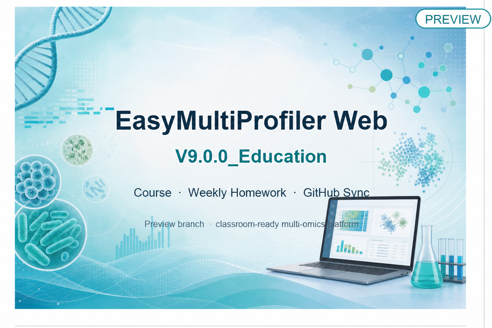
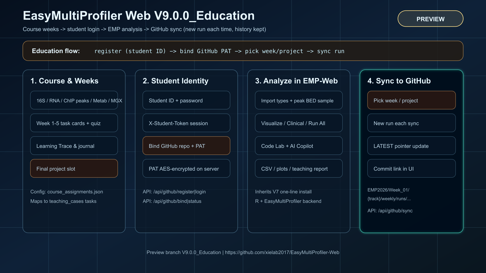

<p align="right">
  <a href="./README.md"></a>
  <a href="./README_EN.md"></a>
</p>

# EasyMultiProfiler Web · v9.0.4

**Windows release · build 9.0.4** — On top of V7 one-click install and multi-omics analysis, this build adds **weekly course homework + student ID login + GitHub repo sync**, plus ChIP / multi-omics joint workflows from V9.


> **Branch**: [`main`](https://github.com/xielab2017/EasyMultiProfiler-Web/tree/main)  
> **Version**: `9.0.4`



---

## What is this

EasyMultiProfiler Web is a browser-based multi-omics downstream analysis platform (Plumber R API + static frontend + EasyMultiProfiler core).

**v9.0.4** targets research and teaching. Students and course users can:

1. Complete micro-lessons, quizzes, and hands-on work by case / week in **Course**
2. Sign in with **student ID + name (required) + a self-set passphrase**
3. Connect a GitHub homework repository they can write to
4. On the **Export** page, sync the current weekly assignment or final project to the target repo in one click (**each sync creates a new run and keeps history**)
5. Still download CSV / PDF / RDS locally when needed


---

## Architecture overview



> Vector source: [docs/TECHNICAL_MODE_V9_EDUCATION.svg](docs/TECHNICAL_MODE_V9_EDUCATION.svg) (same content as the figure above)

| Layer | Capability |
|-------|------------|
| Course | 4 omics tracks + **Customize**; assignments for weeks **1–16** + major course work + final project + custom assignments |
| Student | Student-ID registration/login; server session token (`X-Student-Token`) |
| Analyze | Full V7 inheritance: import, preprocessing, differential/diversity, visualization, Clinical, Run All, Code Lab, AI |
| Sync | Package manifest / tables / plots / teaching report → push to the student’s agreed repo paths |

---

## One-line start (`main`)

Scripts auto-detect the OS, install missing git / python3 / R / EMP dependencies, and start the web UI.

| Shell | Command |
|------|---------|
| **macOS / Linux (bash / zsh)** | `bash -c "$(curl -fsSL https://raw.githubusercontent.com/xielab2017/EasyMultiProfiler-Web/main/webapp/scripts/install_from_github.sh)"` |
| **Windows PowerShell** | `irm https://raw.githubusercontent.com/xielab2017/EasyMultiProfiler-Web/main/webapp/scripts/install_from_github.ps1 \| iex` |

### Already cloned

```bash
git clone -b main https://github.com/xielab2017/EasyMultiProfiler-Web.git
cd EasyMultiProfiler-Web
bash install.sh                  # macOS / Linux
# or Windows: install.cmd / Start-EMP-Web.bat
```

Common local development command:

```bash
bash webapp/scripts/start_local.sh
```

- Web UI: http://127.0.0.1:8080  
- API: http://127.0.0.1:8000/api/health  

### Stop

Closing the browser does **not** stop background services. Use the stop entry for your platform (same directory as the start scripts):

| Platform | Double-click / command |
|----------|------------------------|
| **macOS** | `Stop-EMP-Web-Mac.command`, or `bash webapp/scripts/stop_local.sh` |
| **Windows** | `Stop-EMP-Web-Windows.bat`, or `Restart-EMP-Web.bat` (stop then start) |

Stop scripts terminate API / Web / Gateway PIDs recorded under `.local_run` and free default ports `8000` / `8080` / `8090`.

---

## Students: GitHub homework sync (Export page)

### Prepare

1. Students enter their GitHub repository URL on the Export page  
2. Deployments may optionally set `EMP_CLASS_HOMEWORK_REPO` and `EMP_CLASS_GITHUB_TOKEN` to bind a shared class repo automatically  
3. Without a shared class repo, students prepare their own PAT (fine-grained, **Contents: Read and write** on the target repo)  
4. (Optional) Set `EMP_GITHUB_SECRET_KEY` to encrypt stored tokens  

### Steps

1. Open **Export** in the left nav  
2. **Register / log in** (student ID + **name required** + passphrase ≥ 8 characters)  
3. The repo URL is locked to the class homework repo; if a token is required, paste the PAT and click **Bind repository**  
4. Choose the **course track** and **weekly assignment / final project**  
5. Click **Sync to GitHub** → open the returned commit link to verify  

### Repository layout convention

```text
EMP2026/
  Week_01/
    microbiome_16s/
      weekly/
        LATEST
        runs/<timestamp>/
          manifest.json      # student ID, version, GitHub, git_path
          data/ results/ plots/ teaching/
    transcriptomics/
      weekly/
        ...
  Week_02/
    ...
  Project_Major/
    transcriptomics/
      project/
        runs/...
  profile.json               # student ID, GitHub account/repo, EMP version, latest git_path
  _ledger/<run_id>.json      # one record per sync (incremental; history kept)
  README.md
```

Path rule: `EMP2026 / Week_XX / <track> / <assignment type> / runs / ...`  
- Week folders: `Week_01` … `Week_16` (sortable; UI shows Week 1–16)  
- Track under week (e.g. `transcriptomics`, `microbiome_16s`, `clinical`)  
- Assignment type: `weekly` or `project` (project work under `Project_Major/`)

Sync strategy: **incremental**; each sync creates `runs/<timestamp>/` and does not delete existing repo files.

---

## Notes for instructors / TAs

- Assignment slots: [`webapp/data/course_assignments.json`](webapp/data/course_assignments.json)  
- Teaching cases: [`webapp/data/teaching_cases.json`](webapp/data/teaching_cases.json)  
- Student data directory: `students/` under the platform data root (override with `EMP_STUDENTS_DIR`)  
- For grading, inspect `Week_XX/<track>/weekly/` plus `profile.json` / `_ledger/` in the student repo  
- Each sync records student ID, GitHub login/repo, EMP version, and `git_path`  
- LAN / Tailscale access: [`webapp/docs/LAN_TAILSCALE_ACCESS.md`](webapp/docs/LAN_TAILSCALE_ACCESS.md)

---

## Main APIs (education sync)

| Method | Path | Description |
|--------|------|-------------|
| GET | `/api/github/assignments` | Weekly / project assignment list |
| POST | `/api/github/register` | Student-ID registration (name required); ensures class repo |
| POST | `/api/github/login` | Login; returns `student_token` + class-repo status |
| GET | `/api/github/status` | Login and bind status (includes `class_homework_repo`) |
| POST | `/api/github/ensure_class_repo` | Ensure binding to the class homework repo |
| POST | `/api/github/bind` | Bind class repo + PAT (always points to class repo) |
| POST | `/api/github/sync` | Sync to a given week / project |
| GET | `/api/github/syncs` | Local sync history |

Header: `X-Student-Token: <token>` (attached automatically by the frontend after login).

---

## What’s new vs V7

- **Weekly** course assignment model (wired to case tasks)  
- **Student ID + passphrase** identity  
- **GitHub bind and one-click sync** (run history retained)  
- Export-page GitHub class-repo panel (zh/en i18n)  
- Inherits V7: zero-dependency one-click install, multi-omics workflows, AI Copilot, Code Lab, Run All, and more  

Technical architecture (V7 analysis core still applies): [`docs/TECHNICAL_MODE_V6.svg`](docs/TECHNICAL_MODE_V6.svg)

---

## Documentation index

| Doc | Content |
|-----|---------|
| [docs/INSTALL_MAC.md](docs/INSTALL_MAC.md) | macOS / Linux install |
| [docs/INSTALL_WINDOWS.md](docs/INSTALL_WINDOWS.md) | Windows install |
| [docs/USER_GUIDE_V5.md](docs/USER_GUIDE_V5.md) | User guide |
| [docs/CHIP_OPS_GUIDE.md](docs/CHIP_OPS_GUIDE.md) | ChIP-seq / CUT&RUN Step1+Step2 paths |
| [docs/RELEASE_NOTES_v9.0.4.md](docs/RELEASE_NOTES_v9.0.4.md) | This release |
| [CHANGELOG_V7.md](CHANGELOG_V7.md) | V7 changelog |

In-app **Guide** / **Course** panels also provide interactive help.

---

## Repository layout (summary)

```text
EasyMultiProfiler-Web/
├── DESCRIPTION
├── R/                          # EMP R package
├── docs/
│   ├── images/                 # README figures (banner / sync / architecture PNG)
│   ├── TECHNICAL_MODE_V9_EDUCATION.svg
│   └── RELEASE_NOTES_v9.0.4.md
├── README.md                   # Chinese
├── README_EN.md                # English
└── webapp/
    ├── backend/helpers/github_sync.R
    ├── data/course_assignments.json
    ├── data/teaching_cases.json
    ├── frontend/js/github_sync.js
    └── scripts/                # install and local start
```

---

## Success checks

- Open **Course** / **Export** in the UI and see the GitHub sync card  
- `GET /api/github/assignments` returns 4 tracks and weeks  
- After a student binds a repo, sync produces a new commit on GitHub  

---

## License

Artistic-2.0 (aligned with Bioconductor).

## Citation

See the repository homepage and EasyMultiProfiler / Bioconductor citation notes:  
https://github.com/xielab2017/EasyMultiProfiler-Web
