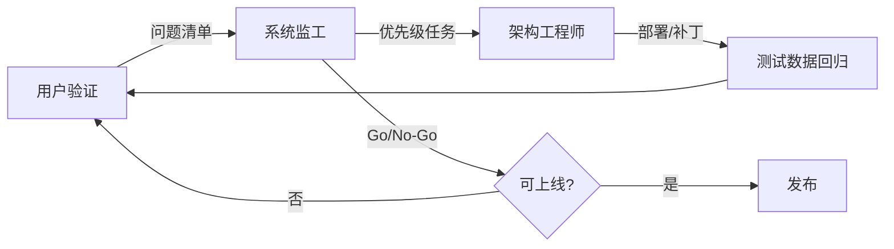

# EMP-Web 三方 Agent 工作流（Gen-Z 用户视角）

> **目标**：以 2000 年后出生的学生/初学者为第一用户，循环优化 EasyMultiProfiler Web，直至可稳定上线教学与自助分析。

## 角色定义

| 角色 | 职责 | 输出物 |
|------|------|--------|
| **用户（Gen-Z 学生）** | 首次使用、跟 Course、跑 16S/RNA-seq/Clinical 示例、反馈挫败点 | 可复现的 UX 问题清单 + 优先级 |
| **系统监工** | 汇总用户意见、对照生产就绪标准、排期与验收 | 迭代 Backlog、阻塞项、Go/No-Go |
| **系统架构工程师** | 实现修复、API/前端/教学联动、回归验证 | PR 级改动 + 测试证据 |

## 工作流循环



### 每轮迭代步骤

1. **用户**：按 Course 案例走完 5 步（视频→测验→实操→反思）；另测「一键示例数据」与 Clinical 独立上传。
2. **监工**：将问题映射到 P0–P3；P0=阻断学习/安全，P1=首日体验，P2=移动端/双语，P3=视觉 polish。
3. **架构师**：每轮至少交付 1 个 P0/P1 + 文档/测试；监工对照清单勾选。
4. **回归**：`webapp/test_outputs/latest/REPORT.md`（40/40）+ 前端 Course 路径 + demo import API。

---

## 第一轮评估摘要（2026-06-20）

### 用户（Gen-Z）核心发现

| # | 问题 | 影响 |
|---|------|------|
| U1 | 默认进 Data 页，Course 被忽略 | 新手直接撞术语墙 |
| U2 | 无示例数据，需自备 CSV | 课程「提供的数据」无法兑现 |
| U3 | 中英混杂、按钮显示 `import` 等内部 ID | 信任感下降 |
| U4 | 11 项侧栏无流程 spine | 不知「现在第几步」 |
| U5 | 拖拽上传 UI 假 affordance | 操作挫败 |
| U6 | `alert()` 打断流 | 体验过时 |
| U7 | Code Lab 与 Prompt  handoff 需手动找面板 | 教学链断裂 |
| U8 | 移动端侧栏仅图标、Omics 挤在 60px 列 | 手机几乎不可用 |
| U9 | 测验错题无定位 | 重复看视频效率低 |
| U10 | 侧栏 footer 显示 bash 安装命令 | 像开发者工具而非学生 App |

### 监工：生产就绪 vs 教学就绪

**教学就绪（局域网/实验课）— 第一轮后改善**

- [x] 默认 Course + 工作流 Stepper
- [x] 一键 16S / RNA-seq / Clinical 示例（`/api/import/demo`）
- [x] Course 卡片进度条、测验错题高亮
- [x] Toast 替代 alert、Code Lab 自动展开
- [x] 真·拖拽上传、移动端 Omics 顶栏

**上线阻塞（公网部署仍需）— 监工 P0**

| 项 | 严重度 | 负责人 |
|----|--------|--------|
| 无认证 / Session 隔离 | 高 | 架构师 |
| `/api/user_r/run` 任意 R 执行 | 严重 | 架构师 |
| LLM 密钥硬编码 | 高 | 架构师 |
| Session 存 `/tmp` 易失 | 高 | 架构师 |
| 缺 `smoke_workflows.py` | 中 | 架构师 |
| CDN 离线依赖 | 中 | 架构师 |

### 架构师：第一轮已实施

- `webapp/backend/helpers/demo_data.R` + `GET /api/demo_datasets` + `POST /api/import/demo`
- 前端：Course 默认页、Welcome、示例按钮、Workflow Stepper、drag-drop
- `teaching.js`：页面中文标签、进度、错题反馈、示例数据联动
- `code_lab.js`：`openCodeLabPanel()`
- CSS：移动端 Omics、进度条、测验错题样式

---

## 第二轮 Backlog（监工 → 架构师）

### P1 — 下一 sprint

- [ ] **i18n 切换**：Nav / 表单 / Code Lab 统一「中文模式」或「English 模式」
- [ ] **Metabolomics / Metagenomics 示例数据** 加入 demo catalog
- [ ] **Course 与 Stepper 双向高亮**：当前 task 的 `emp_page` 在 stepper 上 pulse
- [ ] **Code Lab 默认收起**（初学者 opt-in 展开）
- [ ] **Clinical 多选** 改为 checkbox/tag picker（移动端）
- [ ] **修复 `Clinical-fomal.csv` 文件名** → `Clinical-formal.csv`

### P2 — 体验 polish

- [ ] Dark mode
- [ ] 视频时长/大小 badge
- [ ] Run All vs Analyze 首次 RNA-seq 引导 callout
- [ ] Omics 过滤时 toast 说明隐藏 tab 原因
- [ ] Export 页 Journal 与 Course 第 5 步合并展示

### P0 — 上线前必须

- [ ] JWT/Session auth + 教学 progress 持久化（非 `/tmp`）
- [ ] `user_r/run` 沙箱或生产环境禁用
- [ ] Secrets 外置 + Docker volume 持久化
- [ ] CI：`smoke_local.sh` + 恢复 `smoke_workflows.py`
- [ ] nginx CORS 与 Plumber 对齐

---

## 测试数据路径（验证用）

| 类型 | 路径 |
|------|------|
| 16S 丰度 | `webapp/tests/level-7.csv` |
| 16S metadata | `webapp/tests/meta.csv` |
| RNA-seq counts | `webapp/test_outputs/latest/source_files/RNAseq_output.csv` |
| RNA-seq mapping | `webapp/test_outputs/latest/source_files/RNAseq_mapping.txt` |
| Clinical | `clinical_test/Clinical-test.csv` + `meta-test.csv` |
| 回归报告 | `webapp/test_outputs/latest/REPORT.md` |

### 快速验证命令

```bash
bash webapp/scripts/start_local.sh
curl -s http://127.0.0.1:8000/api/demo_datasets | jq .
curl -s -X POST http://127.0.0.1:8000/api/import/demo \
  -H 'Content-Type: application/json' \
  -d '{"dataset_id":"m16s_course"}' | jq .
```

浏览器：打开 `http://127.0.0.1:8080` → 应默认 **Course** → Data 页可一键加载示例。

---

## Go/No-Go 检查表（监工签字）

**实验课 / 局域网 MVP（当前目标）**

- [x] Course 5 步可完成（视频+测验+跳转+反思）
- [x] 三种示例数据一键导入
- [x] RNA-seq + 16S 后端 40/40 回归有报告
- [ ] 学生手机端完成至少 1 个 Course 步骤（待第二轮 UX）
- [ ] 教师可导出 Learning Trace / 项目报告

**公网生产**

- [ ] 全部 P0 安全项关闭
- [ ] 持久化 Session + 认证
- [ ] CI 绿灯 + Docker 一键部署文档更新

---

## 如何使用本工作流（给 Cursor Agent）

1. 启动 **用户** subagent：读 `frontend/` + 走 Course，输出编号问题。
2. **监工** agent：读 `AGENT_WORKFLOW.md` + 用户报告，更新 Backlog 与 Go/No-Go。
3. **架构师** agent：按 P0→P1 实现，跑 `start_local.sh` + curl demo + 必要时 R smoke。
4. 监工验收后进入下一轮，直到 Go/No-Go 全绿。

*文档版本：Round 1 · 2026-06-20*
